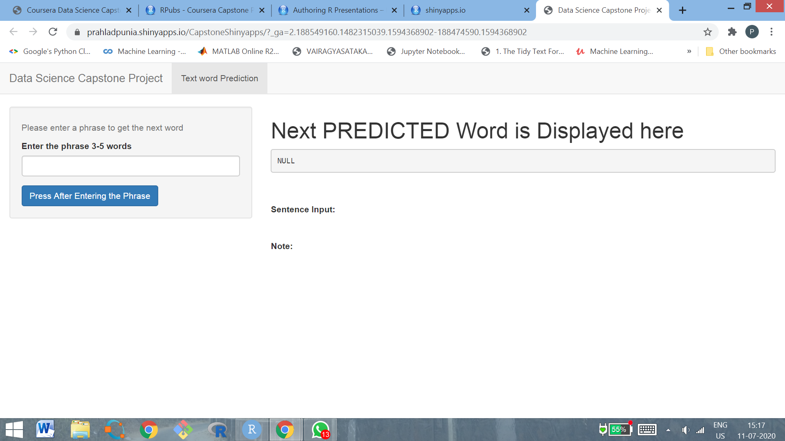

Shinyapp Presentation - Coursera Data  Science Specialization Final Capstone Project
=========================================================================
author:    Prahlad
date:      July10, 2020
autosize: true

Overview
========================================================================
## Objective
- **To build a ShinyApp to predict next word**   
- **Model used-Ngram based on Markov and Katz's Back-off**     
- **Data used from corpus HC Corpora**   

### **Inputs three text files (Only English data selected)**    
  + **Blog**   
  + **News**   
  + **Twitter**         
  

Files    |  Lines      |   Words    | Size(MB)  
---------|-------------|------------|---------
         |             |            |
**Blogs**	   |  **899288**	   | **37570839**	  | **200.4242**	
**News**	   |  **1010242**	   | **34494539**	  | **196.2775**	
**Twitter**	 |  **2360148**	   | **30451170**	  | **159.3641**	
**Total**	   |  **4269678**	   | **102516548**  | **556.0658**	

- **Above File Sizes are very big to handle (4.2 million lines/ 556 MB)**   
- **Random sampling was used to sample data (sample size 1% was used)**    
- **This 1% sample size is based on the RAM constraints, run-time. 
   Tried with higher sample size 2% but the system hangs.**   
- **The data was cleaned of numbers, punctuations, whitespaces, links, handles,       
   unnecessary marks, converted to lower case  etc.;**   
-  **Matrices Ngrams(5,4,3,2,1) word pairing were constructed**    

Algorithm Used
========================================================
- **Algorithm is a Combinations of "Back-off" Algorithm by M Katz and "Markov Process" and "Stupid back-off" by Google**   
- **As per Markov the next word depends on the last few words (N-grams)**   
- **Back-off calculates the conditional probability of each Words that 
  might complete N-gram**  
- **Back-off takes max-likelihood ratio estimator of each potential completed N-gram
  (no of occurrences of n-gram in training set/no of occurrences of (n-1) word prefix for 
   same n-gram )**   
- **If this ratio is zero (n-gram not in trg set) model backs-off to look at the ratio
     between ngram and the (n-2) word prefix obtained by lopping the first word from the 
     original prefix**    
- **This process is repeated continuously, each time multiplying by a factor between zero 
    and one lets say k**   
- **If the prefix is reduced to no words (i.e. the completing word is not in the training set at all (or is only found at the very beginning of the training set), a smoothing algorithm is needed.Computationally this requires more resources.**          
- **"Stupid Back-off" can do these computations with less resources and almost same results by keeping k=.4**        

Working of the Predictive Model
========================================================================================
- **Ngram for the model is used to predict the next word based on the previous 5,4,3,2,1 words**     
 
- **As discussed above, we are using only Back-off Algorithm in its basic form**    
- **Sort the Ngrams from highest to lowest frequencies**   
- **System looks for 5gram, which has the first four words that are equal to the last four  words of the input phrase entered by the user.**   
- **if no 5gram is found, algorithm backs off to 4grams - searches for the first three words amongst 4grams that are equal to the last three words of the user entered input phrase**   
- **if no 4gram is found, algorithm backs off to 3gram- looks for the second word amongst 3gram that are equal to the last two  word of the input phrase**   
- **If no 3gram is found, algorithm backs off to bigram - looks for one word amongst bigram that is equal to the last one word of the input phrase** 
- **if no bigram is found, algorithm backs off to unigram -looks for the word with the highest frequency**   
- **Efficiency of the model depends on the size of the sample of the training data.The model has been developed by five ngram  matrices. These matrices are based on the samples of the original dataset. The efficiency is as good as the trainig samples**    

- **Better accuracy can be achieved by increasing the sample size, but it requires more computational resources and increases the response time.**   
  
ShinyApp
========================================================
## Shinyapp User Instructions  
- **The final UI user interface is shown on right**    
- **The user has to insert a Phrase and Press the button**  
- **The system will predict the next word usning N-gram discussed above** 
- **If system fails to predict a default word with highest frequency will appear**  

***

## Screenshot of Shinyapp

***

